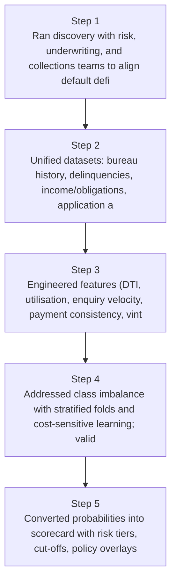
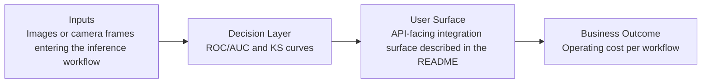
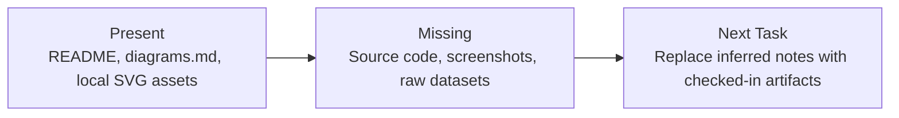

# NPA Risk Prediction Diagrams

Generated on 2026-04-26T04:29:37Z from README narrative plus project blueprint requirements.

## Model development lifecycle

## ROC/AUC and KS curves

## Evidence Gap Map

